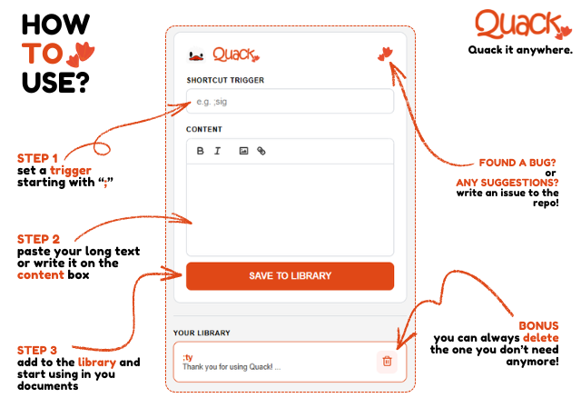

  

  

# Quack

**Universal, lightning-fast rich text expansion. Quack it anywhere.**

Quack is a productivity-focused browser extension designed to help you expand short triggers into full, rich-text signatures or snippets; complete with images and formatting.

### Features
* Powered by Quill.js for Rich Text Support (bold, italics, links, and images).
* Automatically strips malicious code from pasted content.
*  Handles large signatures and images without hitting default browser limits.
* Works across all websites, including Gmail, Outlook, and LinkedIn.
* A satisfying *quack* whenever you open the dashboard.

###

  

---

### Installation
1. **Download:** Click the green **Code** button and select **Download ZIP**.
2. **Extract:** Unzip the folder to a permanent location on your computer.
3. **Brave/Chrome Setup:**
   * Go to `brave://extensions` or `chrome://extensions`.
   * Enable **Developer mode** (top right toggle).
   * Click **Load unpacked**.
   * Select the `Quack` folder you just extracted.
4. **Usage:** Click the  icon in your toolbar, set a trigger (like `;sig`), and you're ready to Quack!

---

### Contributing

We welcome contributions from the community! Here are some guidelines to help you get started:

#### Reporting Bugs

If you find a bug, please report it by opening an issue on the [GitHub repository](https://github.com/psykiiib/Quack/issues). Include as much detail as possible, such as steps to reproduce the bug, your operating system, and browser version.

#### Feature Requests

If you have an idea for a new feature, please open an issue on the [GitHub repository](https://github.com/psykiiib/Quack/issues) and describe your idea in detail. We appreciate all suggestions and feedback!

### License
**Quack** is free for personal use under the **Polyform Noncommercial License 1.0.0**.

🚫 **Commercial use is not allowed without permission.**

### Contact

If you have any questions or need further assistance, feel free to open an issue on the [GitHub repository](https://github.com/psykiiib/Quack/issues). If you are a business or wish to use this extension for commercial advantage, please contact me using any of my socials on my profile.

---

Thank you for contributing to Quack!

